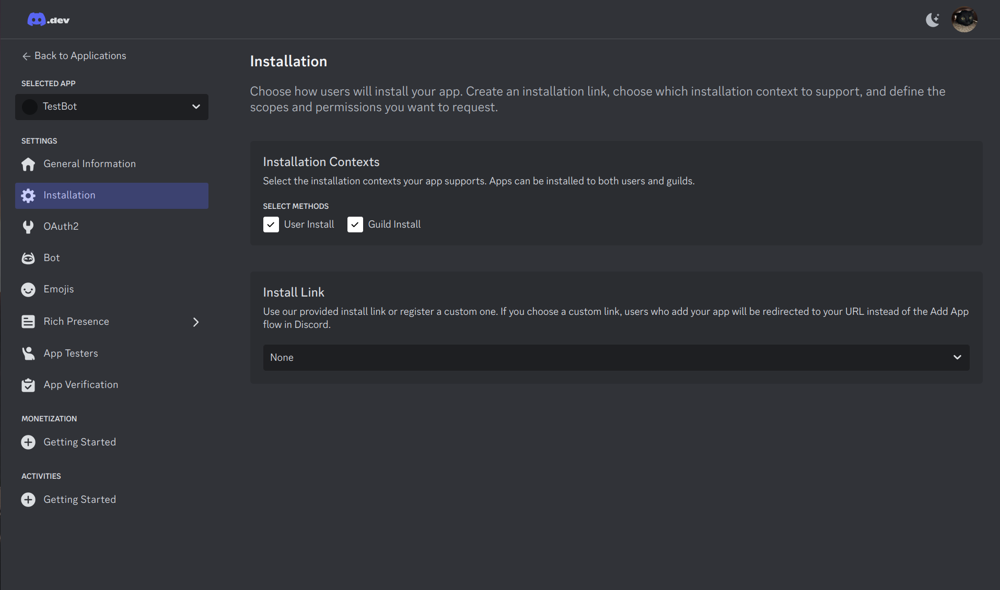
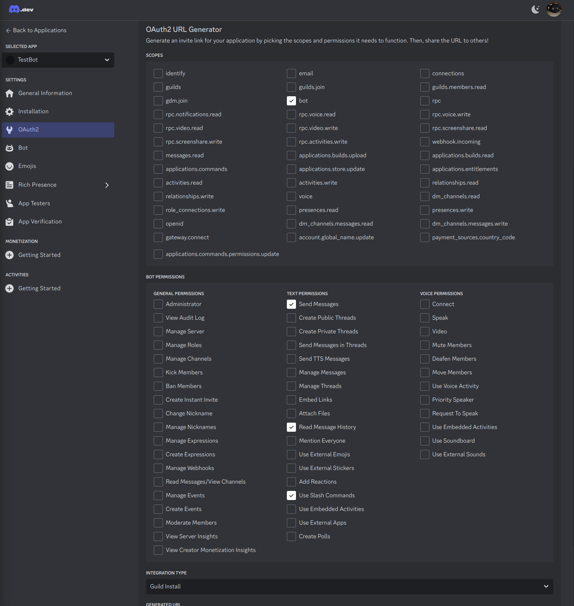
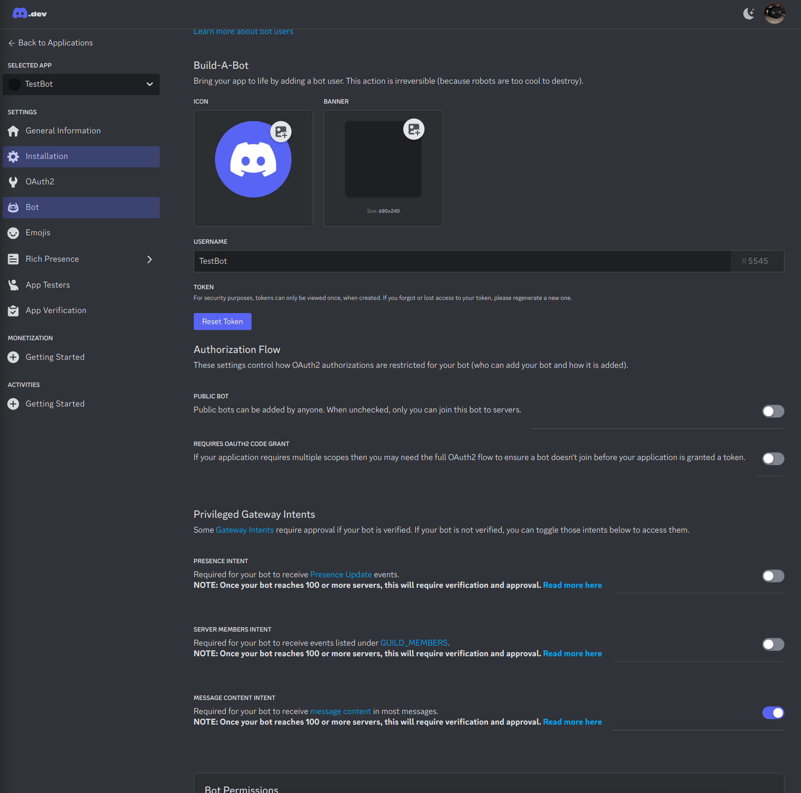
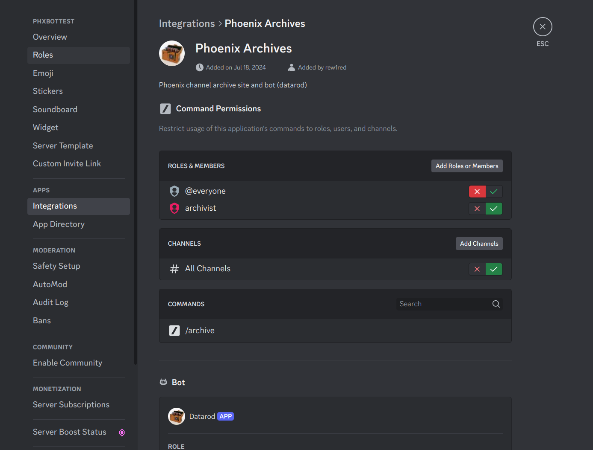

# Installation Guide

## Create a Bot

1. https://discord.com/developers/applications
2. Click "New Application"
3. Give the Bot a name and description

### On the "Installation" Tab

1. Set "Install Link" to "none
2. In "OAuth2 URL Generator" select "bot"
3. In "Bot Permissions", select "Send Messages", "Read Message History", and "Use Slash Commands"
4. Copy the "Generated URL" - **save this url for a future step**, you will use it to add the bot to your server




### On the "OAuth2" Tab

1. Cope the "Client ID" - **save this id for a future step**, this will become your `SOCIAL_AUTH_DISCORD_KEY`
2. Select "Reset Secret"
3. Copy the "Client Secret"- **save this id for a future step**, this will become your `SOCIAL_AUTH_DISCORD_SECRET`

### On the "Bot" Tab

1. Give the bot a username
2. Select "Reset Token" - **save this token for a future step**, this will become your `DISCORD_TOKEN`
3. Disable "Public Bot"
4. Enable "Message Content Intent"



## Gather Information from Discord

1. Open Discord
2. Click on the settings cog in the bottom left corner
3. Go to Advanced (under "app settings")
4. Toggle "Developer Mode" on - This will allow you to copy object ID's
5. Close settings
6. Right click on the name of your server. Select "Copy Server ID" - **save this id for a future step**, this will become your `DISCORD_GUILD_ID`

## Create Archivist Role

Administrative functions in the app are assigned based on a defined role.

1. Create a role on your sever for administrative users. We used "Archivist" in the examples.
2. Right click on the name of the role. Select "Copy Role ID" - **save this id for a future step**, this will become your `DISCORD_GUILD_STAFF_ROLE_ID`

## Configure The Bot

Create a `.production.env` file. If you are managing environment variables for deployment in another fashion, configure the following variables there.

Inside of this new file, paste the following:

```
DISCORD_TOKEN=<Discord Bot Token - Created when you created the bot>
DISCORD_GUILD_ID=<Guild ID - Copied out of Discord>
SOCIAL_AUTH_DISCORD_KEY=<Discord Client ID - Created on the OAuth2 Tab>
SOCIAL_AUTH_DISCORD_SECRET=<Discord Client Secret - Created on the OAuth2 Tab>
DISCORD_GUILD_STAFF_ROLE_ID=<Role ID - Copied out of Discord>

```

## Invite the Bot

1. Paste the invite link (generated in Step 4 of "On the "Installation" Tab) into your browser to invite the bot to your server
2. Open Discord
3. Edit your server
4. Go to Integrations (under "Apps")
5. Select "Manage Integration"
6. Remove bot access from "@everyone", and grant it to the bot user role previously created


